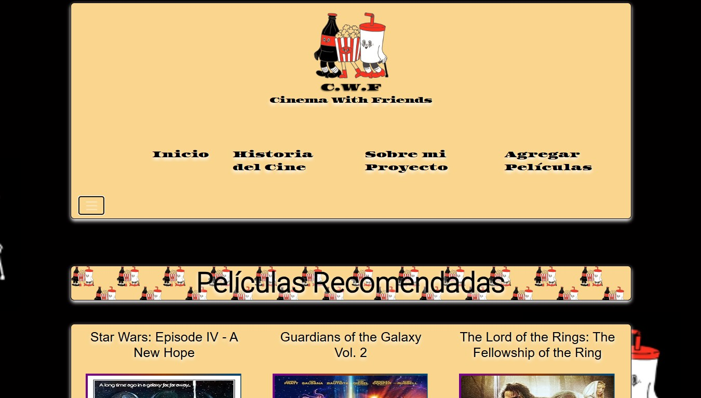
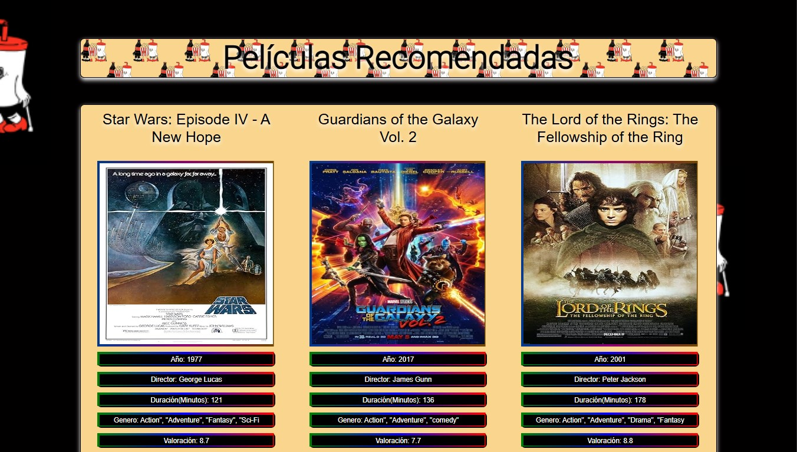
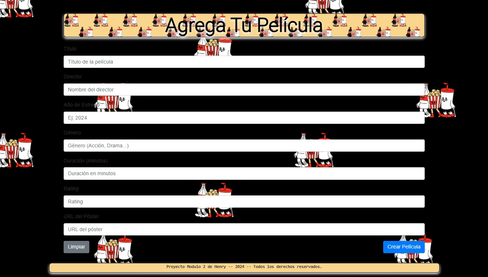

# CWF - Cinema With Friends - Proyecto del Modulo 2
Este es el proyecto del Modulo 2 presentado en Henry, el cual realicé en solitario. En este proyecto utilizamos HTML, JavaScript, CSS en el front, y MongoDB para la base de datos.
MOVIE FRIENDS.png

  

**Cinema With Friends** es una plataforma diseñada para hacer cartelera de peliculas de cine, donde podrás encontrar las peliculas recomendadas por otros, y tambien recomendar tus peliculas favoritas.

## Vista previa

  
   
  
   
  
   

